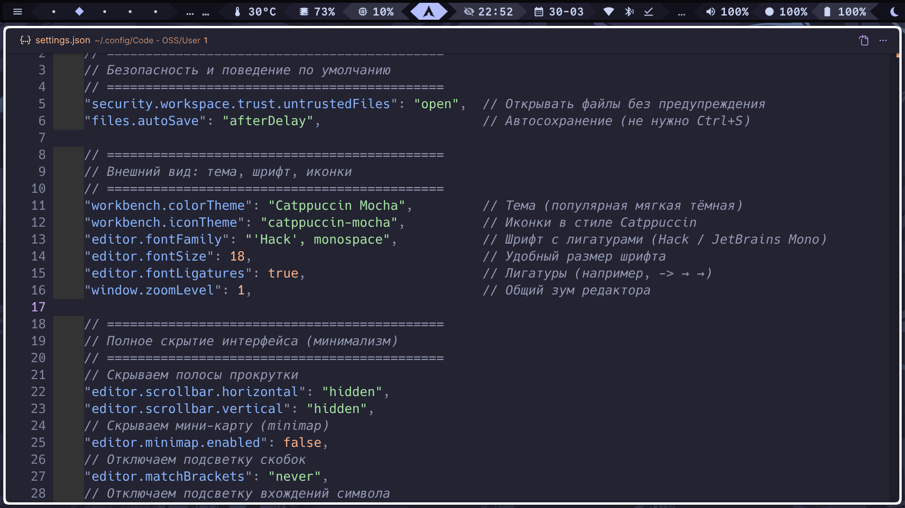

<!-- Logo / Header -->
<p align="center">
  
</p>

<h1 align="center">
  🧘 VS Code Minimalist Settings
</h1>

<p align="center">
  <strong>Clean, distraction‑free editor config — focus on code, nothing else.</strong><br>
  <strong>Чистая конфигурация без отвлечений — сосредоточьтесь на коде, ни на чём другом.</strong>
</p>

<p align="center">
  <a href="#english">🇬🇧 English</a> • <a href="#russian">🇷🇺 Русский</a>
</p>

<p align="center">
  
  
  
</p>

---

## 🇬🇧 <span id="english">English</span>

> **Focus on code, nothing else.**  
> This configuration hides every possible UI element that doesn’t directly help you write code.  
> No scrollbars, no minimap, no status bar, no tabs clutter — just you and your editor.

<p align="center">
  
  <br>
  <em>(Replace `screenshot.png` with your actual screenshot)</em>
</p>

### ✨ Features

- **🗑️ Hidden distractions**  
  Scrollbars, minimap, breadcrumbs, folding controls, activity bar, status bar, secondary sidebars, tabs (only one visible), indentation guides, active line highlight, and even the command center.

- **🎨 Beautiful theme & icons**  
  Uses [Catppuccin Mocha](https://github.com/catppuccin/vscode) and matching icons for a modern, eye‑friendly look.

- **🔤 Developer‑friendly fonts**  
  [Hack](https://github.com/source-foundry/Hack) with ligatures enabled. JetBrains Mono also works – just change the setting.

- **⚙️ Smart defaults**  
  Auto‑save, 4‑space tabs, C++23 support via clangd, and no confirmation on file delete.

- **⌨️ Everything is still accessible**  
  Hidden elements can be temporarily shown via keyboard shortcuts (e.g., `Ctrl+B` for sidebar, `Ctrl+Shift+F` for search, etc.).

### 📥 Installation

1. **Backup your existing settings**  
   ```bash
   # Linux/macOS
   mv ~/.config/Code/User/settings.json ~/.config/Code/User/settings.json.backup
   # Windows (PowerShell)
   Move-Item $env:APPDATA\Code\User\settings.json $env:APPDATA\Code\User\settings.json.backup
   2.    Copy the new settings

        Manual: Download settings.json from this repo and place it in:

            Windows: %APPDATA%\Code\User\

            macOS: ~/Library/Application Support/Code/User/

            Linux: ~/.config/Code/User/

        One‑line (Linux/macOS):
        bash

        curl -o ~/.config/Code/User/settings.json https://raw.githubusercontent.com/nikitu0008-collab/VS-Code-Minimalist-Settings-Clean-distraction-free-editor-config/main/settings.json

        Symlink (to update via git):
        bash

        git clone https://github.com/nikitu0008-collab/VS-Code-Minimalist-Settings-Clean-distraction-free-editor-config.git ~/vscode-minimalist
        ln -s ~/vscode-minimalist/settings.json ~/.config/Code/User/settings.json

    Install required extensions

        Catppuccin Theme

        Catppuccin Icons

        Hack Font (optional, recommended)

        clangd (for C++)

🛠️ Customization
Setting	Key	Options
Change font	editor.fontFamily	'JetBrains Mono', monospace
Show scrollbars	editor.scrollbar.horizontal	"auto" / "visible"
Bring back status bar	workbench.statusBar.visible	true
Show minimap	editor.minimap.enabled	true
Show tabs	workbench.editor.showTabs	"multiple"
Restore activity bar	workbench.activityBar.location	"left" or "right"
Disable auto‑save	files.autoSave	"off"

All settings are commented in the JSON file.
🤔 Philosophy

The default VS Code interface is packed with buttons, panels, and indicators that are rarely needed during focused coding.
This config removes everything that isn’t strictly about writing and reading code.
If you ever need a hidden element, you can quickly access it via its keyboard shortcut.

This approach is inspired by the “zen mode” but taken further — it’s the ultimate distraction‑free setup.
🇷🇺 <span id="russian">Русский</span>

    Сосредоточьтесь на коде, ни на чём другом.
    Эта конфигурация скрывает все возможные элементы интерфейса, которые не помогают непосредственно писать код.
    Никаких полос прокрутки, мини‑карты, статус‑бара, лишних вкладок — только вы и редактор.

<p align="center">  <br> <em>(Замените `screenshot.png` на ваш реальный скриншот)</em> </p>
✨ Возможности

    🗑️ Скрытые отвлекающие элементы
    Полосы прокрутки, мини‑карта, хлебные крошки, элементы сворачивания кода, панель активности, статус‑бар, второстепенные боковые панели, вкладки (видна только одна), направляющие отступов, подсветка активной строки и даже командный центр.

    🎨 Красивая тема и иконки
    Используется Catppuccin Mocha и соответствующие иконки для современного, приятного для глаз вида.

    🔤 Удобные шрифты
    Hack с включёнными лигатурами. Также работает JetBrains Mono – просто измените настройку.

    ⚙️ Умные настройки по умолчанию
    Автосохранение, табуляция в 4 пробела, поддержка C++23 через clangd, отключено подтверждение при удалении файлов.

    ⌨️ Всё по‑прежнему доступно
    Скрытые элементы можно временно показать с помощью горячих клавиш (например, Ctrl+B для боковой панели, Ctrl+Shift+F для поиска и т.д.).

📥 Установка

    Сделайте резервную копию текущих настроек
    bash

    # Linux/macOS
    mv ~/.config/Code/User/settings.json ~/.config/Code/User/settings.json.backup
    # Windows (PowerShell)
    Move-Item $env:APPDATA\Code\User\settings.json $env:APPDATA\Code\User\settings.json.backup

    Скопируйте новые настройки

        Вручную: Скачайте settings.json из этого репозитория и поместите его в:

            Windows: %APPDATA%\Code\User\

            macOS: ~/Library/Application Support/Code/User/

            Linux: ~/.config/Code/User/

        Одной строкой (Linux/macOS):
        bash

        curl -o ~/.config/Code/User/settings.json https://raw.githubusercontent.com/nikitu0008-collab/VS-Code-Minimalist-Settings-Clean-distraction-free-editor-config/main/settings.json

        Симлинк (чтобы обновлять через git):
        bash

        git clone https://github.com/nikitu0008-collab/VS-Code-Minimalist-Settings-Clean-distraction-free-editor-config.git ~/vscode-minimalist
        ln -s ~/vscode-minimalist/settings.json ~/.config/Code/User/settings.json

    Установите необходимые расширения

        Тема Catppuccin

        Иконки Catppuccin

        Шрифт Hack (рекомендуется)

        clangd (для C++)

🛠️ Настройка под себя
Параметр	Ключ	Варианты
Сменить шрифт	editor.fontFamily	'JetBrains Mono', monospace
Показать полосы прокрутки	editor.scrollbar.horizontal	"auto" / "visible"
Вернуть статус‑бар	workbench.statusBar.visible	true
Показать мини‑карту	editor.minimap.enabled	true
Показать вкладки	workbench.editor.showTabs	"multiple"
Вернуть панель активности	workbench.activityBar.location	"left" или "right"
Отключить автосохранение	files.autoSave	"off"

Все настройки в JSON‑файле прокомментированы.
🤔 Философия

Интерфейс VS Code по умолчанию переполнен кнопками, панелями и индикаторами, которые редко нужны во время сосредоточенной работы.
Эта конфигурация убирает всё, что не связано напрямую с написанием и чтением кода.
Если вам вдруг понадобился скрытый элемент, вы всегда можете быстро вызвать его с помощью горячей клавиши.

Этот подход вдохновлён “режимом дзен”, но идёт дальше — это максимально свободная от отвлекающих элементов среда.
📜 License / Лицензия

MIT — feel free to use, share, and modify.
MIT — свободно используйте, делитесь и изменяйте.
🙏 Acknowledgements / Благодарности

    Catppuccin – for the beautiful theme and icons / за прекрасную тему и иконки.

    Hack font – for the excellent typeface / за отличный шрифт.

    The VS Code team – for building an incredibly customizable editor / за создание невероятно настраиваемого редактора.
